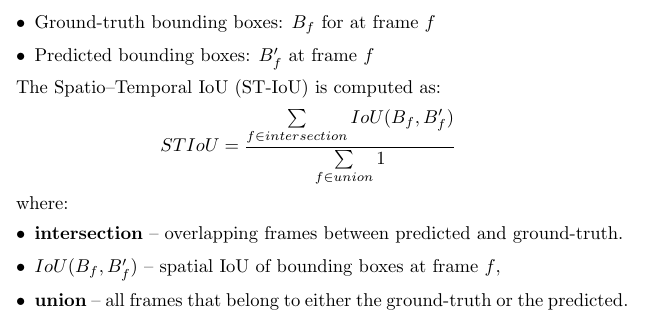
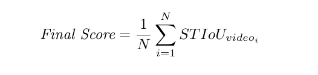

# AeroEyes – Autonomous Drone Search and Localization

## Description

In emergency and disaster response scenarios, autonomous drones play a crucial role in locating missing persons or critical objects in challenging environments such as flooded zones, forests, or post-storm areas.

This challenge encourages participants to design AI models capable of searching for and localizing a specific object from the drone, based on limited reference images.

**Your mission:** Build a perception system that can determine when and where a given target object appears in drone-captured footage — simulating a real-world search-and-rescue mission.

## Competition Structure

### Qualification Round

The qualification round is conducted on pre-recorded drone videos provided by the organizers, simulating real-world aerial search missions:

- You are provided with **three images** of a target object (such as a backpack, person, laptop, bicycle, etc.)
- A drone video scanning an area from above
- Your task is to **predict the bounding boxes** of the object in each detected frame
- This is a **spatio-temporal localization task** that requires recognizing and tracking the target under various scales and viewpoints

### Final Round

In the final round, the same algorithms will be deployed on real drones for autonomous search in a physical terrain:

- The **top 5 teams** from the qualification phase will compete offline in Ho Chi Minh City
- Teams will be responsible for their own participation expenses
- Models should be efficient enough for real-time deployment on Jetson-based drones

## Evaluation

### 1. Qualification Round

The evaluation uses a **3-D Spatio–Temporal Intersection-over-Union (ST-IoU)** metric that jointly measures when and where the target object is correctly detected in the video. Unlike traditional metrics that treat temporal and spatial accuracy separately, ST-IoU considers them as one continuous space–time volume.

A detection only receives credit if both the timing and the bounding boxes align correctly with the ground truth.

#### 1.1 Definition

For each video, let:



#### 1.2 Scoring and Aggregation

For each video, the final score is the ST-IoU value between predicted and ground-truth spatio–temporal volumes. The overall leaderboard score is the mean ST-IoU across all evaluation videos:



### 2. Final Round

The top 5 teams from the qualification phase will advance to the on-site final in Ho Chi Minh City. Each team will deploy their model on a real drone equipped with NVIDIA Jetson hardware. The drone must autonomously search for unknown location objects in a physical terrain setup.

Teams will be evaluated based on:

- **Detection accuracy** (temporal + spatial)
- **Search efficiency** (time to locate the object)
- **Real-time performance** (inference speed and stability)

## Data

### 1. Directory Structure

All data are provided in a single folder containing reference images, drone videos, and ground-truth annotations. Participants are free to create their own training and validation splits for model development.

```
dataset/
├── samples/
│   ├── drone_video_001/
│   │   ├── object_images/
│   │   │   ├── img_1.jpg
│   │   │   ├── img_2.jpg
│   │   │   └── img_3.jpg
│   │   └── drone_video.mp4
│   ├── drone_video_002/
│   │   ├── object_images/
│   │   │   ├── img_1.jpg
│   │   │   ├── img_2.jpg
│   │   │   └── img_3.jpg
│   │   └── drone_video.mp4
│   └── ...
└── annotations/
    └── annotations.json
```

- `samples/` — contains all drone video samples and their corresponding reference object images
- `object_images/` — three RGB images of the target object captured from ground-level viewpoints
- `drone_video.mp4` — a 3-5 minute drone-captured video (25 fps) showing the search area
- `annotations/` — JSON file containing ground-truth labels for all samples

### 2. Ground-Truth Annotation Format

Each record in `annotations.json` specifies when the target object appears and where it is located within the corresponding video.

```json
{
  "video_id": "drone_video_01",
  "annotations": [
    {
      "bboxes": [
        { "frame": 370, "x1": 422, "y1": 310, "x2": 470, "y2": 355 },
        { "frame": 371, "x1": 424, "y1": 312, "x2": 468, "y2": 354 },
        { "frame": 372, "x1": 426, "y1": 314, "x2": 469, "y2": 356 }
      ]
    }
  ]
}
```

**Field Description:**

- `video_id`: unique identifier of the drone video
- `bboxes`: list of bounding boxes (x1, y1, x2, y2) per frame (absolute pixel coordinates)
- Each video may contain one or more visible intervals

### 3. Expected Submission Format

- Predictions must follow the same schema as the ground-truth annotations
- Every provided video must appear in the submission file — even if the object is not detected (`"detections": []`)

```json
[
  {
    "video_id": "drone_vid001",
    "detections": [
      {
        "bboxes": [
          { "frame": 370, "x1": 422, "y1": 310, "x2": 470, "y2": 355 },
          { "frame": 371, "x1": 424, "y1": 312, "x2": 468, "y2": 354 }
        ]
      }
    ]
  },
  {
    "video_id": "drone_video_002",
    "detections": []
  }
]
```

### Download

- Training data: [download](https://dl-challenge.zalo.ai/2025/Drone/observing.zip)
- Public test: [download](https://dl-challenge.zalo.ai/2025/Drone/public_test.zip)

## Rules

- **Open-source data/models allowed**
- **Model inference must run in real time (>15 FPS)** on target hardware: NVIDIA Jetson
- **External connectivity (Wi-Fi / cloud inference) is not allowed**
- After the competition ends, participants commit not to store any training data for personal purposes

## Getting Started

1. Download the training data and public test
2. Explore the dataset structure
3. Develop your spatio-temporal object detection model
4. Ensure real-time performance (>15 FPS on Jetson)
5. Generate predictions in JSON format
6. Submit to the challenge platform

## Technical Considerations

- **Few-shot object detection**: Only 3 reference images provided
- **Scale variation**: Objects appear at different distances from the drone
- **Viewpoint changes**: Aerial perspective vs ground-level reference images
- **Real-time constraint**: Must run at >15 FPS on Jetson hardware
- **Tracking consistency**: Maintain temporal coherence across frames
- **Efficiency**: Optimize for edge deployment

## Final Round Preparation

For teams advancing to the final round:

- Test your model on NVIDIA Jetson hardware
- Optimize for real-time inference
- Prepare for autonomous deployment
- Plan your travel to Ho Chi Minh City
- Budget for participation expenses

Good luck! 🚁
